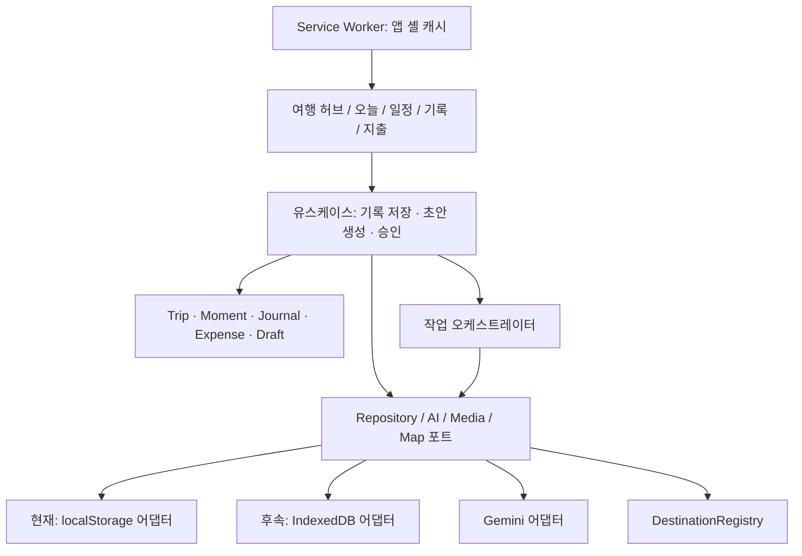

# 술술트래블 확장 아키텍처

기준: 2026-09-07 / 앱 v1.2.4. 목표 구조와 현재 이행 상태를 함께 기록한다. v1.2.4는 AI 초안 검토, revision, 저장 경계의 첫 단계를 앱에 연결했다. 기능별 화면 분리와 IndexedDB 이전은 후속이다.

## 1. 제품 방향과 코드 진단

중심 경험은 **여행 중 짧게 남긴 기록을 다시 읽고 싶은 다이어리로 만드는 것**이다. 일정·지도·지출은 기록의 맥락을 공급한다. 여행 전 계획 → 여행 중 수집 → 하루 마감 초안 → 여행 후 회고로 연결한다.

| 진단 근거 | 문제 및 영향 | 상태 |
| --- | --- | --- |
| `index.html`에 State·렌더러·저장·AI 함수 집중 | 한 기능 수정이 여러 화면에 함께 영향 | 후속 분리 |
| 이전 `generateAiItinerary`: `trip.days = parsedDays` | 기존 일정 즉시 교체 | v1.2.4 해결 |
| 이전 오프라인 생성기의 `d.spots` 재할당 | AI 실패 시 기존 일정 교체 | v1.2.4 제거 |
| 이전 일기 윤문이 현재 textarea 수정 | 여행/날짜 전환 시 오적용 가능 | v1.2.4 해결 |
| 이전 OCR 실패 시 모의 값 입력 | 예시 금액을 실제 판독으로 오인 가능 | v1.2.4 제거 |
| `st_trips_v2` 전체 배열 저장 | 데이터 증가 시 전체 직렬화 | repository 경계 완료, IDB 후속 |
| 외부 CDN 및 지도 타일 | 최초 접속·미캐시 자원·AI까지 완전 오프라인은 부정확 | 경계 문서화, 번들링 후속 |
| `DestinationRegistry`와 목적지 팩 | 기존 확장 지점 | 유지 |

오프라인 약속은 사전 준비된 앱 셸, 저장된 일정/기록 조회 및 수동 작성이다. AI·최신 정보·미캐시 지도는 별도 이용 가능 상태를 표시한다.

## 2. 구조 결정

현재는 **기능별 모듈을 가진 단일 PWA**를 유지한다. 프레임워크 전환이나 마이크로서비스 도입을 선행 조건으로 삼지 않는다. 개발 테스트에 Node를 사용할 수 있지만 앱 실행에 서버나 빌드를 필수로 만들지 않는다.



의존성은 UI → application → domain이다. domain은 DOM·fetch·localStorage·AI SDK를 참조하지 않는다. infrastructure가 포트를 구현하고 앱 시작점에서 주입한다. AI가 repository나 DOM을 직접 수정하지 못하게 한다.

```text
js/
  app/                       # 초기화·라우팅·의존성 조립 (후속)
  domain/                    # 엔터티·검증·비용/날짜 계산 (후속)
  application/
    orchestration.mjs        # 이번에 추가
    use-cases/               # captureMoment, proposeJournal, acceptDraft (후속)
  features/
    today/ trips/ itinerary/ journal/ expenses/ settings/  # 후속
  infrastructure/
    storage/ ai/ media/ maps/ # 후속
  destinations/              # 기존 유지
tests/orchestration.test.mjs  # 이번에 추가
```

공용 색상·간격·글꼴·상태 토큰을 먼저 정의하고 화면별 CSS를 이동한다. 기존 광범위한 클래스 색상 덮어쓰기는 점진적으로 제거한다.

## 3. 데이터 계약

여행 하위 엔터티는 `id`, `tripId`, `revision`, `createdAt`, `updatedAt`을 가진다. 현지 날짜 `YYYY-MM-DD`, IANA timeZone, 실제 시각 UTC ISO를 분리한다. 같은 날 국경을 넘을 수 있으므로 Moment에도 당시 시간대를 남긴다.

| 엔터티 | 주요 필드 | 불변 조건 |
| --- | --- | --- |
| Trip | title, startDate, endDate, timeZone, baseCurrency | 여행 간 참조 금지, 종료일 ≥ 시작일 |
| ItineraryItem | localDate, localTime, placeId, source, isDraft | 계획은 방문 사실이 아님 |
| Moment | text, capturedAt, timeZone, localDate, mediaIds, placeId | 원문 보존, 위치 선택 입력 |
| Journal | localDate, originalText, acceptedText, momentIds | 원문과 AI 버전 분리 |
| Media | blobRef, thumbnailRef, mimeType, width, height | 3:4는 썸네일 표현; 원본 비율 보존은 후속 옵션 |
| Expense | amountMinor, currency, rateSnapshot, occurredAt | 통화별 소수 자릿수 적용, 과거 환산액 보존 |
| Draft | targetId, baseRevision, payload, sourceIds, status | 승인 시 revision 비교, 전체 원본 무단 교체 금지 |
| Job | id, tripId, targetId, kind, state, attempts, errorCode | 로그에 비밀키·원본 사진 제외 |

rateSnapshot은 rate, baseCurrency, quoteCurrency, source, observedAt, method(수동/추정/청구 확정)를 가진다. 고정 배율 계산을 실제 청구액으로 표시하지 않고 확정 청구액 수정 경로를 둔다.

## 4. 저장소 이전

1. 먼저 LegacyTripRepository로 `st_trips_v2` 접근을 감싼다. 여행 ID 조회와 revision 기반 갱신만 공개한다.
2. 후속 IDB stores: trips, itineraryItems, moments, journals, media, expenses, drafts, jobs, migrations. `[tripId, localDate]`로 조회한다.
3. 이전 전 JSON 백업과 원본 문자열을 보존한다. 파싱 실패 시 빈 배열을 덮어 저장하지 않고 복구 화면을 제공한다.
4. 원본 검증 → 결정적 ID 변환 → 단일 IDB 트랜잭션 → 개수/참조/읽기 검증 → 완료 마커 순으로 진행한다. 실패하면 원본 경로를 유지한다.
5. 전환 후 쓰기 주체는 IDB 하나다. 계속 이중 쓰기하지 않는다. 전환 뒤 구버전 앱으로 단순 롤백하면 새 기록을 놓치므로 내보내기/호환 변환 절차가 필요하다.
6. 사진 포함 백업 복원 검증 전 원본을 삭제하지 않는다. 저장 용량을 표시하고 저장 실패 시 성공 토스트를 띄우지 않는다.

IndexedDB는 구조화 데이터·Blob·트랜잭션을 지원하지만 용량 및 삭제 위험은 남는다. 영속 저장 요청도 백업을 대신하지 않는다. [IndexedDB](https://developer.mozilla.org/en-US/docs/Web/API/IndexedDB_API), [저장 한도와 퇴거](https://developer.mozilla.org/en-US/docs/Web/API/Storage_API/Storage_quotas_and_eviction_criteria).

## 5. AI·동기화 경계

개인 모드는 사용자 제공 키로 직접 호출하는 현재 구조를 유지한다. 브라우저 키 보관과 선택 데이터의 제공자 전송을 정확히 설명한다. 공개 서비스 전환 시 서버 측 키 보관·인증·사용량 제한을 별도 ADR로 결정한다. 이는 Zero-Backend 규칙의 변경이며 이번에 도입하지 않는다. [Gemini 키 지침](https://ai.google.dev/gemini-api/docs/api-key).

모델명은 단일 설정에서 관리하고 배포 시 지원 여부를 확인한다. 구조화 응답을 사용하되 날짜·금액·참조 ID·장소 사실은 앱에서 재검증한다. 스키마 준수는 사실 정확성 보장이 아니다. [구조화 출력](https://ai.google.dev/gemini-api/docs/structured-output).

현재 Gist/URL 공유는 백업·스냅샷으로 분류한다. 실시간 공동편집을 약속하지 않는다. 후속 동기화는 revision, tombstone, outbox, 충돌 사본을 도입한 뒤 선택 서비스로 설계한다. 다른 기기 기록을 마지막 쓰기로 조용히 덮어쓰지 않는다.

## 6. 기존 실록과의 관계

R-3 초안 및 여행 격리·DOM ID 보존은 강화한다. R-2 localStorage SSOT는 이전 단계까지 유지하며 IDB 도입 시 함께 개정한다. R-4 압축 규칙은 현재 유지하고 후속에 썸네일/보존 미디어를 분리한다. R-5는 취소 신호와 오류 분류를 반영했고 R-13의 모의 OCR 자동 입력은 제거했다. R-7 배너 ID를 보존하고 모바일 요약 표현을 설계한다.

v1.2.4에서 위험한 AI 직접 쓰기 경로는 제거했다. IDB·백엔드·새 정보 구조 도입 완료를 뜻하지 않는다. [오케스트레이션](orchestration.md), [UI/UX](ux-blueprint.md), [개발 모델](development-model.md)을 함께 따른다.
