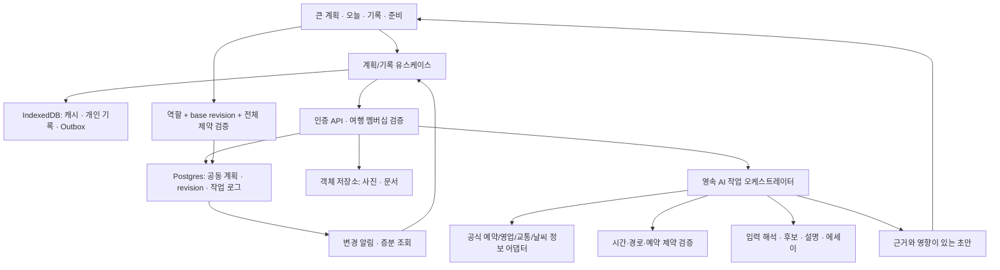

# AI·공동편집·평생 보관 아키텍처

상태: 목표 설계. 현재는 정적 PWA, localStorage 여행 문서, 메모리 AI 작업, Gist 스냅샷이다. 이번에 서버나 실시간 공동편집을 배포하지 않았다.

## 1. 경계 결정

사용자의 공동 참여 요구를 충족하려면 **개인 모드의 로컬 작성 + 공동 모드의 인증된 공유 저장소**가 필요하다. 같은 URL·룸코드·Gist를 공유하는 것만으로 충돌에 안전한 실시간 공동편집이 되지는 않는다. 개인 기록과 공개되지 않은 문서는 사용자 영역, 공동 계획은 여행 공간 영역이다.

프런트는 기존 PWA를 유지하면서 기능별 모듈로 이전한다. 백엔드는 처음부터 마이크로서비스로 나누지 않고 인증/API/작업 실행/저장을 가진 단일 서비스로 시작한다. 관계형 DB+객체 저장소+실시간 전달을 포트 뒤에 둔다. 관리형 후보로 Supabase의 Postgres/Auth/Storage/Realtime을 검토할 수 있지만 계정·리전·요금·운영 담당은 도입 시 결정한다. Realtime 이벤트는 알림이며 DB의 권한·버전 검증을 대신하지 않는다. [Realtime 공식 문서](https://supabase.com/docs/guides/realtime), [행 단위 접근 정책](https://supabase.com/docs/guides/database/postgres/row-level-security).



## 2. 데이터 모델

| 엔터티 | 주요 필드 / 관계 |
| --- | --- |
| TripSpace | id, ownerId, phase, localStartDate, localEndDate, baseCurrency, currentPlanRevision |
| TripMember | tripId, userId, role, joinedAt, revokedAt. 조정 권한은 서버에서 검증 |
| PlanVersion | id, tripId, parentId, status(draft/accepted/superseded), authorId, acceptedAt |
| PlanBlock | id, tripId, city/placeId, arrival/departure, nights, coreExperienceIds, stayIds, participantIds |
| PlanItem | stable id, blockId, localDate/timeZone, plannedStart/end, duration, flexibility, priority, bookingId, revision |
| TravelLeg | from/to itemId, mode, departure time, duration range, access/wait/transfer/buffer, sourceId, checkedAt |
| Booking | providerRef(제한 열람), status, fixedStart/end, releaseAt, deadline, cancellationRule, assigneeId, evidenceId |
| Evidence | sourceUrl, sourceType, retrievedAt, validForDate, placeId, field, value, confidenceClass, expiry |
| ChangeProposal | id, basePlanRevision, itemVersions, reason, patchOps, impacts, sourceIds, status, approvals |
| Experience | id, tripId, planItemId(optional), actualStart/end, confirmedBy, participantIds, status(visited/skipped/unconfirmed) |
| Moment | id, tripId, experienceId(optional), authorId, originalText, mediaIds, capturedAt, timeZone, visibility, revision |
| Expense | amountMinor, currency, rateSnapshot, payerId, split, receiptRef, occurredAt, visibility |
| DaySummary / StoryVersion | sourceExperienceIds, sourceMomentIds, author/editor, acceptedText, createdAt, revision |
| Operation / Outbox | opId, actorId, deviceId, entityId, baseRevision, payload, status, serverSequence |

큰 계획의 변경은 실제 경험을 삭제하지 않는다. 일정에서 삭제한 장소도 이미 방문했다면 Experience와 Moment가 남는다. 호텔 숙박 날짜는 `[checkInLocalDate, checkOutLocalDate)` 구간, 항공은 출발·도착 각 지역 시간대+UTC 시각으로 저장한다. 문서 시간대는 가져오기 힌트일 뿐 여행 현지 시간대가 아니다.

## 3. AI 계획 오케스트레이션

하나의 조정기가 상태와 데이터 계약을 관리한다. 아래 단계는 책임 분리이며 매번 LLM 에이전트 여러 개를 띄우라는 뜻이 아니다. 목적지별 독립 정보 조회는 병렬화할 수 있지만 계획 확정은 한 트랜잭션이다.

1. **입력 해석**: 목적·기간·인원·숙소·필수 경험·공식 예약을 구조화. 문서 지시는 데이터로 취급. 필수 정보가 없으면 최소 질문 또는 미정 상태.
2. **거시 계획**: 도시 순서·박수·장거리 이동 후보. 예약 확정 전에는 서로 다른 2~3안으로 비교.
3. **근거 수집**: 장소 동일성, 운영 날짜, 마지막 입장, 예약 슬롯·발권 시점, 교통편, 접근/환승을 출처와 함께 조회. 개인 신원 문서는 별도 권한 없이 AI 입력에 포함하지 않음.
4. **후보 배치**: 장소 간 소요시간 행렬과 고정 시간·휴식·숙소·예산 제약으로 세부 일정을 계산. 출발 시각에 따라 이동값이 달라질 수 있음.
5. **검증**: 필수 예약 누락, 닫힌 장소, 불가능한 환승, 중복 항목, 날짜/시간대, 개인별 이동 요구, 지역 데이터 지원 여부.
6. **설명과 초안**: 모델은 추천 이유·차이·모르는 정보를 설명. 계산 결과를 임의로 바꾸지 않음.
7. **승인**: 사용자가 비교 후 확정. 서버는 멤버십·revision·제약을 재검증하고 단일 변경 로그와 함께 적용.

계획에는 이동·식사·휴식·짐 보관·마지막 도보까지 시간을 배정한다. 차량 7인 탑승 가능 여부와 수하물 용량도 별도 확인 항목이다. 어떤 목적지에서도 모든 경로 데이터를 얻을 수 있다고 약속하지 않는다. 지원이 부족한 지역은 검증된 목적지 팩/공식 사업자 자료/사용자 입력으로 전환하며 ‘추정’ 상태를 유지한다.

[Routes API](https://developers.google.com/maps/documentation/routes/compute_route_matrix)는 출발·도착 쌍의 이동거리·시간을 얻는 수단으로 검토할 수 있다. [OR-Tools의 시간창 경로 모델](https://developers.google.com/optimization/routing/vrptw)은 허용 방문 시간과 이동시간을 함께 제약하는 참고다. 실제 관광 일정은 선택적 방문·예약·그룹 선호를 추가해야 하므로 공식 예제를 그대로 최적 플래너라 부르지 않는다.

### 무엇을 최적화할 것인가

먼저 hard constraints(확정 예약, 출발/도착 시간, 접근 불가능 구간, 완료 기록, 불가 조건)를 충족한다. 그다음 이동시간·환승·추가 비용·보행 부담·일정 변경량을 줄이고 선택한 경험 만족도를 높인다. 그룹 평균만 최적화해 어린이·고령자·이동 제약이 있는 동행자의 제한을 무시하지 않는다.

해가 없으면 ‘전부 방문 가능’으로 조작하지 않는다. 충돌한 제약과 가능한 완화(선택 경험 제외 / 다음 날 이동 / 예약 재확인)를 제안한다. 사용자가 완화를 선택해야 다시 계산한다. 전역 최적성은 증명된 경우에만 표기하고 일반 UI는 ‘조건에 맞는 추천안’이라고 한다.

### 정보 신뢰와 예약 과제

Evidence는 ‘공식 확인 / 사용자 확인 / 추정 / 확인 필요’를 구분한다. 운영시간·요금·입국·날씨는 조회 시각과 대상 날짜를 함께 표시한다. 역사적 시트 정보는 새 여행에서 만료된 참고로 시작한다. 정보 필드마다 갱신 정책을 두고, 상충 정보는 출처를 나란히 보여준다.

‘예약 필요’는 ‘예약됨’이 아니다. 예약 항목은 `unknown → research_needed → booking_required → booking_open → booked → reconfirm_needed → used/cancelled` 등 필요한 상태를 가진다. 발권 개시 시각은 해당 지역 시간대로, 담당자·인원·취소 조건과 연결한다. 리마인더 전달은 서버 작업이 구현된 뒤에만 보장한다. 앱을 닫은 상태의 알림을 정적 PWA만으로 약속하지 않는다.

## 4. RePlan 계약

```json
{
  "proposalId": "proposal-example",
  "tripId": "trip-example",
  "basePlanRevision": 12,
  "scope": {"fromItemId": "item-next", "throughLocalDate": "2026-04-10"},
  "protectedIds": ["item-visited", "booking-fixed"],
  "operations": [
    {"op": "reschedule", "itemId": "item-next", "baseRevision": 3, "startLocal": "14:30"},
    {"op": "defer", "itemId": "item-optional", "baseRevision": 2}
  ],
  "validation": {"status": "needs_confirmation", "unknowns": ["route_duration"]},
  "sourceIds": ["user-event-example"]
}
```

예시는 계약 모양이며 실제 여행 데이터가 아니다. 변경안은 원본 일정 추가 병합으로 구현하지 않는다. stable itemId별 추가·수정·제외·순서 변경을 표현하고, 제외된 항목의 이력과 연결된 기록을 보존한다.

작업 상태는 `queued → collecting → calculating → validating → awaiting_review → applying → applied`이다. 실패·취소·네트워크 대기·충돌은 별도 상태. 기존 Orchestrator의 승인·취소 계약은 재사용하지만 영속 작업 저장, 단계별 근거, item revision을 확장한다.

- 요청 시 원본 계획과 영향 구간을 캡처한다. 응답 시 화면에 선택된 여행을 다시 조회해 대상을 결정하지 않는다.
- 적용 직전 현재 계획을 재읽고 서버 트랜잭션에서 plan revision을 비교한다. 경합 시 덮지 않고 재비교한다.
- 동일 opId 재전송은 같은 결과를 반환한다. 로그·계획 업데이트가 하나의 트랜잭션 안에 저장된다.
- 작성 중 취소는 늦게 도착한 결과도 버린다. applying 중에는 저장 결과를 먼저 확인한다.
- 되돌리기는 과거 배열 복원이 아니라 현재 버전에 대한 보상 변경안이다. 이후 타인의 편집이나 실제 방문 기록을 없애지 않는다.
- 오프라인 수동 변경은 로컬 초안·Outbox에 저장한다. 온라인 재연결 때 승인 권한과 revision을 다시 확인한다.

## 5. 공동편집 일관성

1차 공동 계획은 여행별 plan revision으로 직렬 적용한다. 여행 규모에서는 이해하기 쉽고 예약·이동의 교차 제약을 한 번에 검사할 수 있다. 항목 revision도 보유해 어떤 항목이 바뀌었는지 충돌 UI를 만든다. 상이한 항목 변경의 자동 재기준화는 전체 제약 재검증을 통과한 경우에만 허용한다.

댓글·순간 기록은 별도 UUID 기반 append로 동시 추가를 허용한다. 같은 개인 메모의 동시 수정은 원문 두 사본을 보존하고 선택한다. 일정 배열에 last-write-wins를 적용하지 않는다. 장문 에세이 동시 편집용 CRDT는 필요가 입증된 뒤 도입하며 일정 스케줄링을 해결하는 수단으로 착각하지 않는다.

Realtime 수신 누락에 대비해 서버 sequence를 기록하고 재연결 시 증분을 재조회한다. 오프라인에서 권한이 회수된 변경은 서버가 거절하고 개인 복사본으로 보존한다. 초대는 만료/회수 가능한 토큰, 가입 후 멤버십 검증, 비공개 여행 기본값으로 설계한다. 룸코드는 권한 증명이 아니다.

## 6. 보관·복구·개인정보

IndexedDB는 trips/planBlocks/items/experiences/moments/media/outbox 등으로 나누고 `[tripId, localDate]` 인덱스를 둔다. 사진 원본과 썸네일·업로드 상태는 구분한다. 공동 저장소에는 선택한 공개 범위와 멤버십 정책을 적용한다. 여권·예약번호·정산 원문은 일반 공유 카드/에세이/AI 로그에서 제외한다.

이전 순서: 기존 `st_trips_v2` 원문 백업 → 스키마·중복 ID 검증 → 결정적 ID 매핑 → 단일 IDB 이전 트랜잭션 → 개수·참조·미디어 읽기 검증 → 마커. 실패하면 기존 저장 경로를 유지한다. 검증 전 원본 삭제 금지. 전환 후 쓰기 주체 하나만 유지한다.

장기 백업은 schemaVersion이 있는 JSON+원본 미디어+검사값+Markdown 에세이 묶음. 복원 시험은 별도 저장소에서 수행한다. 공유된 사진의 소유자·출처·삭제/회수 범위를 보관한다. ‘기기에 저장됨’, ‘서버 동기화됨’, ‘복원 검증된 백업’은 서로 다른 표시다.

## 7. 개발 모듈

```text
js/domain/             plan-block, plan-item, constraint, experience, proposal
js/application/        build-big-plan, propose-replan, accept-proposal, record-moment
js/features/           library, big-plan, today, records, preparation, companions
js/infrastructure/     storage, sync, evidence, routing, ai, media
server/                auth, trip-membership, apply-operation, jobs, providers (후속)
tests/fixtures/        익명 계획, 충돌, 날짜, 오프라인, 출력검증 시나리오
```

모델명·비용·요금제는 이 설계에서 고정하지 않는다. 배포 때 지원 상태를 확인하고 provider adapter·예산 상한·timeout·retry 정책으로 관리한다. 프로덕션에서는 서버 키를 사용하고 로그에 프롬프트 원문/사진/키를 기본 남기지 않는다. 사용자 BYOK 개인 모드와 서비스 공동 모드의 비용 주체도 명시한다.
