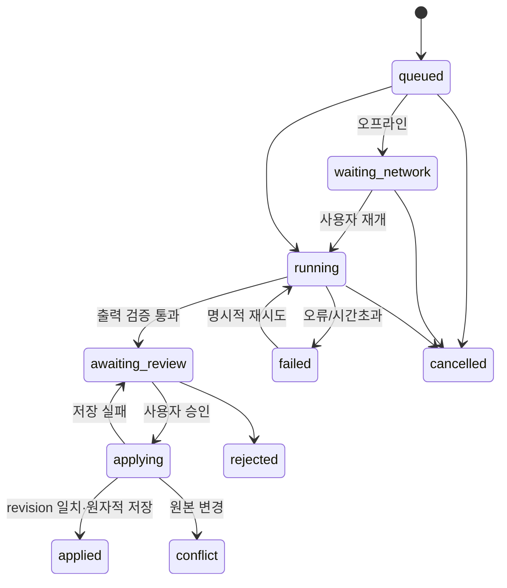

# AI 자동화 오케스트레이션

## 자동화 흐름

| 트리거 | 입력 → 처리 → 출력 | 사용자 통제 |
| --- | --- | --- |
| 빠른 기록 저장 | 메모/사진 → 날짜·여행 연결 → Moment | AI 대기 없이 로컬 저장 |
| 오늘 기록 정리 | 선택 Moment → 사실 추출 → 문체 변환 → Journal 초안 | 원문 비교·수정·승인 |
| 영수증 읽기 | 선택 사진 → OCR → 금액/통화 검증 → Expense 초안 | 불명 항목은 비워서 확인 |
| 하루 일정 제안 | 확정 일정·선호·팩 → 빈 시간 제안 → 초안 | 선택 항목 추가, 중복/충돌 표시 |
| 여행 회고 | 확정 기록·방문 사실 → 장별 구성 → 회고 초안 | 내보내기 전 검토 |

닫힌 브라우저의 매일 자동 실행은 현재 정적 PWA에서 보장하지 않는다. 앱 재방문/날짜 변경 시 “어제 기록 정리하기”를 제안한다. 백그라운드 스케줄링은 서버/푸시 결정 후 설계한다.



요청 시작 시 tripId, targetId, baseRevision, 입력 사본을 고정한다. 응답 시 현재 탭을 조회해 쓰지 않는다. AI는 초안만 생산하고 repository의 compare-and-swap 트랜잭션이 적용한다. 수동 수정 뒤 도착한 초안은 충돌로 남긴다.

## 실행 정책

- 같은 버튼 연속 클릭은 같은 요청 ID, 명시적 재생성은 새 ID를 사용한다.
- 초기값: 동시 실행 1개, 30초 제한, 최대 시도 3회. 지연·비용 실측 후 조정한다.
- 401/403은 키 설정, 입력 오류는 수정, 429는 제공자 대기시간, 일시 서버 오류는 지연 재시도로 분류한다. 모든 오류에 모델 순회를 하지 않는다.
- 취소 후 늦은 응답은 버린다. 네트워크 미연결은 대기 상태다. 재시도는 저장된 원본을 바꾸지 않는다.
- 메모/사진/팩 안의 지시는 데이터로 처리하며 저장소 변경·외부 업로드 명령으로 실행하지 않는다.
- 초안에 sourceIds, 생성 시각, promptVersion, provider/model을 남긴다. 불확실한 장소/금액은 unknown으로 표시한다.
- 일기는 Moment로 확인된 사실만 사용한다. 계획만 있는 장소를 방문했다고 쓰지 않는다. 경로 검증이 없으면 이동시간 확인 필요를 표시한다.

## v1.2.4 실행 코어의 범위

`js/application/orchestration.mjs`는 UI/제공자 독립 코어다. 앱이 Gemini 텍스트·비전 생성기와 LegacyTripRepository 적용기를 주입한다. 요청 중복 방지, 오프라인 대기, 실행 제한, 취소/시간초과, 재시도 상한, 출력 검증, 승인/거절, revision 충돌 처리를 포함한다.

작업 큐는 메모리이며 앱 새로고침 시 복원되지 않는다. Gemini 호출과 초안 적용은 연결됐고, 영속 jobs·오류별 자동 백오프·관측 이벤트는 후속이다. 코어 재시도는 명시적 호출이며 모든 실패에 횟수 제한을 적용한다. LegacyTripRepository는 하나의 localStorage 문서 쓰기 안에서 revision 비교·중복 적용·대상 변경·작업 ID 저장을 처리한다.

```javascript
import { Orchestrator } from './js/application/orchestration.mjs';
const flow = new Orchestrator({
  online: () => navigator.onLine,
  generate: (job, { signal }) => provider.generate(job.input, { signal }),
  validate: (payload) => journalValidator(payload),
  applyDraft: (job) => repository.applyDraft(job) // applied | conflict; 저장 실패 throw
});
const job = flow.enqueue({ id: crypto.randomUUID(), tripId, targetId,
  baseRevision, kind: 'journal', input: { moments: selectedMoments } });
await flow.run(job.id);
// 비교 화면에서 사용자 승인 후에만 호출
await flow.approve(job.id);
```

검증: `node --test tests/orchestration.test.mjs`. 실제 AI를 호출하지 않으며 가짜 제공자/저장소로 데이터 보존과 비동기 경합을 검증한다.

동시 실행 제한은 코어가 기다리는 작업 기준이다. 제공자가 AbortSignal을 무시하면 취소 후에도 원격 연산/과금이 계속될 수 있으므로 실제 어댑터는 signal을 fetch에 전달해야 한다. applyDraft가 저장 완료 후 응답을 잃는 경우도 고려하여 저장소 자체가 job.id에 대해 멱등 적용을 보장해야 한다. applying 중에는 취소하지 않으며, 저장소 트랜잭션 완료/실패로 상태를 결정한다.
