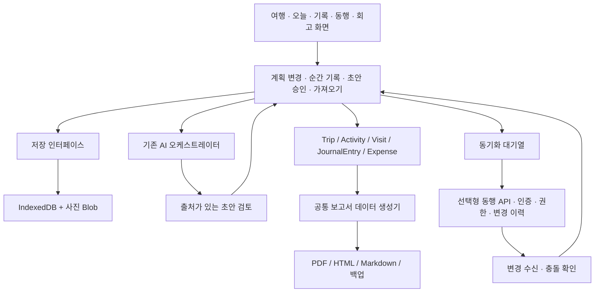

# v1.7.8 제품·아키텍처 통합 검토

검토일: 2026-09-13 · 기준 커밋: `6f3ce57` · 앱 버전: **1.7.8**

사용자가 말한 1.78은 저장소의 v1.7.8로 확인했다. 이번 작업은 현재 구현 검토와 개선 설계이며 앱 기능 변경·데이터 이전·새 릴리스 배포는 하지 않았다. 기존 v1.3.8 검토 결과를 현재 버전의 보증으로 재사용하지 않았다.

## 1. 결론

현재 앱은 개인 여행 계획·수동 기록·AI 초안 검토를 수행하는 로컬 PWA다. 그러나 동행 공동편집과 평생 기록 보관이라는 제품 목표를 충족하려면 **저장 성공 보장, 공유 계약, 기록의 고유 ID, 출력의 원문 추적**을 먼저 정비해야 한다. 프레임워크를 바꾸거나 서버를 여러 개 만드는 것이 선행 과제는 아니다.

기존 모던/라이트그레이/딥블랙과 여행 노트 콘셉트는 유지할 수 있다. 주요 문제는 콘셉트보다 서로 충돌하는 전역 색상 규칙과 기능마다 다른 데이터 처리 방식이다.

## 2. 검토 범위와 방법

- `index.html`, `css/companion.css`, presentation 모듈, 저장 repository, AI orchestration, RePlan, SW, 공유·백업·Gist·PDF 경로와 기존 설계·신록을 읽었다.
- `index.html`은 18,902줄, 명명된 함수 선언 356개로 화면·저장·계산·통신이 집중돼 있다.
- 실제 사용자 기록과 계정에 접근하지 않는 독립 Chrome 프로필에 합성 스페인 여행을 넣었다. 외부 네트워크 요청과 SW를 차단하고 실제 앱 함수로 저장 실패, 공유 왕복, PDF DOM, 테마 대비를 점검했다.
- 재현 도구: `tools/audit-v1.7.8.cjs`. 결과와 스크린샷: `.local-review/audit-v1.7.8/` (Git 제외).
- 실제 카카오톡의 링크 인식 한계, 다른 사람의 기기, 로그인한 Gist, Gemini 실호출, iOS/Android 키보드, 실제 프린터 출력은 이번에 확인하지 않았다. 아래 결과는 코드 확인·합성 브라우저 재현·설계 권고를 구분한다.

## 3. 확인한 문제와 우선순위

| ID / 우선순위 | 확인한 동작 | 사용자 영향 | 개선 방향 |
|---|---|---|---|
| ST-A01 / P0 | `saveJournalText()`는 `saveTrips()`가 false여도 성공 alert와 재렌더 수행. 강제 쿼터 오류에서 디스크에는 이전 원문, 메모리에는 새 원문인데 성공 알림 표시 | 저장했다고 믿은 여행 기록이 재시작 후 사라짐 | 저장 성공 후에만 상태 반영. 실패 초안 유지·재시도·파일로 구조. 사진/완료/복원에도 동일 저장 경계 적용 |
| ST-A02 / P0 | `checkUrlShareImportOnStartup()`도 저장 실패 시 hash 제거와 성공 UI 진행. 재현: 메모리 여행 3개, 디스크 2개 | 받은 여행이 일시적으로만 보이고 원본 링크까지 화면에서 사라짐 | 검증→미리보기→내 기기에 저장→성공 확인 후 URL 정리. 실패 시 재시도와 원본 유지 |
| ST-A03 / P0 | `renderDDayBadge()`의 여행 중 표시: 모던/라이트그레이 글자 `#A7F3D0`, 배경 `#D1FAE5`, 대비 1.13:1 | 상태를 읽기 어려움 | 상태 배경·글자·테두리를 한 컴포넌트가 소유. 사진 위와 일반 카드용 변형을 명시 |
| ST-A04 / P0 | `exportTripAsShareUrl()`에 일정·일기·사진·지출 모두 포함. 합성 작은 여행 869자, 100,000바이트의 압축 효과가 낮은 사진 대용 데이터 추가 시 164,805자 | 메시지 복사·링크 인식·전달의 신뢰성 부족 | 기본은 일정 사본만. 긴 데이터는 파일 공유. 짧은 초대 링크는 서버의 ID 조회 방식으로 별도 구축 |
| ST-A05 / P0 | 공유 payload에 `planBlockMeta`, `status`, 지갑 등 다수 필드 없음. 예산 0을 `budget || 3000000`으로 300만원으로 변환 | 숙소·우선 경험·메모·확정 상태, 새 가계부 구조가 온전히 전달되지 않음 | 버전이 있는 공유 스키마와 왕복 테스트. 전체 백업과 일정 공유를 별도 계약으로 정의 |
| ST-A06 / P0 | PDF 제목에 안전한 `<span data-audit-probe>`를 넣자 실제 HTML 요소로 생성 | 외부에서 받은 문자열을 신뢰하는 렌더링 경계. 다른 삽입 경로도 점검 필요 | 모든 외부 문자열 escape/textContent 적용. 사진 URL 허용 규칙. 가져오기 스키마 검증. 실행 스크립트 공격은 이번에 시도하지 않음 |
| ST-A07 / P1 | 공유받은 여행은 새 ID의 독립 사본. 룸코드 참가 함수는 미지원 안내, 클라우드 저장 함수는 로컬 저장만 수행 | 동료 수정이 자동 반영될 것으로 기대하면 실제와 다름 | ‘사본 보내기’, ‘동행 초대’, ‘내 기기 백업’을 분리. 공동편집 서비스와 권한 모델 추가 |
| ST-A08 / P1 | `journals[dayIndex] = {text, photos}`. 일정별 기록 관계·복수 글·작성 시각·작성자 없음 | 생각날 때마다 새 기록 불가. 일정 이동·날짜 재배치 때 참조 불안정 | 독립 JournalEntry 목록, 고정 dayId/spotId, 기록 시각과 여행 현지 날짜 도입 |
| ST-A09 / P1 | PDF는 모든 스팟 제목을 같은 목록으로 출력. 재현상 방문·건너뜀·예정 모두 포함하지만 시간·설명 누락. 없는 날씨·감정을 ‘맑음/감동’으로 채움 | 실제 여행의 사실과 계획을 구분할 수 없고 에세이 근거가 부정확 | 일정과 방문 이력, 원문 기록, 사진 캡션을 시간순으로 연결. 미입력 값은 생략 |
| ST-A10 / P1 | Gist push는 전체 여행 문서 PATCH, pull은 `State.trips` 교체. 충돌 병합·멤버 권한 없음 | 두 사람이 수정하면 마지막 백업/복원으로 다른 기록을 덮을 수 있음 | 개인 백업으로 한정. 공동편집은 엔터티 revision과 변경 로그로 처리 |
| ST-A11 / P1 | 최신 가계부는 meal/transport 등의 분류를 사용하나 PDF는 food/flight 등 구분. 공유 스키마는 wallets도 누락 | 화면·사본·결산이 다른 내용을 보여줄 가능성 | 단일 Expense/Wallet 분류와 보고서 집계 함수를 공유. 실제 환전·환불 포함 시나리오 테스트 필요 |
| ST-A12 / P1 | AI 일정 최소 개수가 현재 장기여행 3개/일, 일반 4개/일, 첫·마지막 2개로 완화됨. 테스트는 과거 6개 요구 | 이전 30분 일정 밀도 기대와 현 계약 불일치 | 날짜별 분할 생성·검토. 활동 시간, 이동·휴식, 시간 충돌·완성도를 검증하고 단순 개수 검증에 의존하지 않음 |

P0는 기록 신뢰성과 즉시 사용 장애에 해당한다. 검토 우선순위이며 해결 완료를 뜻하지 않는다.

### 밝은 테마에서만 흐려지는 이유

v1.7.7의 밝은 테마 전역 가드가 `bg-emerald-*` 배경을 밝게 바꾼다. 그런데 글자 가드는 원래 `bg-emerald-9*` 클래스가 있는 요소를 제외하므로 원래 어두운 배경용 밝은 글자가 남는다. 배경과 글자를 서로 다른 조건으로 덮어쓰는 것이 원인이다. CSS에 AAA라는 설명이 있어도 실제 대비를 보장하지 않는다.

합성 배지를 흰 바탕에 올린 동일 조건에서 딥블랙은 4.40:1이었다. 실제 어두운 카드 위에서는 반투명 배경 합성값이 달라지므로 이 수치를 딥블랙 전체의 부적합 판정으로 쓰지 않는다. 모던·라이트그레이 배경은 불투명하므로 1.13:1이 카드 위치와 무관하게 재현된다.

일반 텍스트 대비 목표는 최소 4.5:1, 작은 상태 표시는 가능하면 7:1로 여유를 둔다. 전체 AAA 인증이나 ‘무결점’ 표현은 자동 측정과 수동 검증 없이 사용하지 않는다. [W3C 대비 기준](https://www.w3.org/WAI/WCAG22/Understanding/contrast-minimum.html).

### 공유·백업의 중요한 구분

현재 공유는 작은 여행에서 앱의 정상 export/import 왕복에 성공했고, 복사본 수정은 원본에 영향을 주지 않았다. 이것은 동기화 성공이 아니다. 카카오톡에서 실패하는 정확한 문자 수는 실기기·앱 버전별 검증이 필요하다. 164,805자는 길이 문제의 구조적 재현이지 카카오톡의 공식 제한값이 아니다.

`window.location.origin + pathname`을 사용하므로 localhost에서 만든 링크는 다른 사람의 기기로 전달해도 서버 주소로 쓸 수 없다. 운영 origin 검사·경고가 필요하다. URL 압축은 암호화가 아니며 기본 공유에 개인 일기와 지출을 함께 넣지 않아야 한다.

Gist `public:false`는 비공개 저장소가 아니라 **secret gist**다. URL을 아는 사람은 볼 수 있어 `sync.html`의 비공개 저장소 설명과 실제 구현이 맞지 않는다. 공동여행에 PAT를 공유하는 방식은 사용하지 않는다. [GitHub Gist 공식 설명](https://docs.github.com/en/get-started/writing-on-github/editing-and-sharing-content-with-gists/creating-gists).

## 4. 유지할 구현과 보완할 연결

| 흐름 | 현재 강점 | 남은 연결 |
|---|---|---|
| 큰 계획 → 일별 일정 | 거점 구조·구간 편집·일정 상세가 있음 | 공유 메타 보존, 변경 후 날짜/기록 관계 검증 |
| 일정 → AI → 승인 | orchestration의 승인·취소·재시도·revision 및 보호 일정 테스트 통과 | 여러 사용자의 수정까지 반영하는 엔터티 revision, 장기여행 분할 생성 |
| 오늘 → 방문 완료 → 기록 | 완료·고정 토글과 하루 일기 진입 있음 | 실제 방문 시각과 장소별 기록, 저장 실패 복구 |
| 영수증 → 가계부 → 보고서 | OCR 검토와 다통화·지갑 기능 있음 | 공통 분류·환전/환불 의미·공유/보고서의 스키마 일치 |
| 지도 → 장소 탐색 | 목적지 팩과 국가 힌트, 지도 바운즈 보정 있음 | 국가 중심 fallback을 정확한 명소 좌표처럼 보이지 않게 표시, 실제 이동 시간/운영시간은 검증 출처 필요 |
| 기록 → AI 윤문 | 원문 기반 윤문과 승인 경계 있음 | 하루 전체/여행 전체 묶음, 출처 ID, 여러 원문 버전 보존 |
| 기록 → PDF | 일기와 사진 출력 경로 있음 | 시간·활동·작성자·완료 여부·원문 관계, 페이지 넘김·긴 본문·사진 방향 테스트 |
| 저장 → 백업 → 복원 | 로컬 repository·JSON·Gist 경로 있음 | 모든 저장 결과 확인, 복원 전 사본, 빈 배열/중복/구버전/대용량/잘린 Gist 검증 |

AI 부분의 보호 장치는 유지한다. 브라우저 UI에 직접 상태를 쓰는 일반 저장 경로에도 같은 원칙을 적용한다.

## 5. 다이어리 중심의 목표 데이터 구조

`하루에 한 문서` 대신 **여행 → 하루 → 여러 순간 기록**을 기본으로 하고 기록을 개별 일정에 선택적으로 연결한다. 하루 마감 글은 여러 순간을 모은 별도 회고다.

| 엔터티 | 핵심 필드 | 원칙 |
|---|---|---|
| Trip | id, schemaVersion, revision, timeZone, state | 앱 릴리스 버전과 데이터 스키마 버전 분리 |
| Day | id, tripId, localDate, sortOrder | 화면 배열 순번을 영구 참조키로 사용하지 않음 |
| PlanBlock / Activity | id, tripId, dayId, place, plannedStart, plannedEnd, state | 계획·완료·건너뜀은 명시 상태. 재배치해도 ID 유지 |
| Visit | id, activityId, occurredAt, timeZone, state, authorId | 방문 사실과 계획 분리. 위치는 선택 입력 |
| JournalEntry | id, tripId, dayId, activityId?, text, kind, occurredAt, timeZone, localDate, authorId, visibility, revision | 하루 여러 건. 일정 연결은 선택. 개인 글 기본값은 private |
| Media | id, ownerId, blobRef, thumbnailRef, caption, capturedAt, contentHash | 본문 JSON에 Base64 반복 저장하지 않음. 원본과 3:4 썸네일 분리 |
| EssayDraft | id, scope, sourceRefs[], acceptedText, revision, status | sourceRefs에 entry/visit ID와 revision 저장. 원문은 별도 보존 |
| Membership / Change | tripId, userId, role / entityId, baseRevision, operationId, patch | 역할별 서버 검증·충돌 표시·중복 적용 방지 |

`JournalEntry.kind`는 moment/day-reflection을 구분한다. 하루 회고도 여러 편 쓸 수 있다. 일정 삭제/이동 때 연결된 기록을 지우지 않고 당시 장소·일정 제목 snapshot을 남겨 연결 변경을 사용자에게 안내한다. 예정 시각과 실제 발생 시각, 기기 시각과 현지 날짜를 분리한다.

### 기존 기록 이전

1. 원본 `st_trips_v2`와 사진 포함 백업 확보. AI 일기 overflow의 미복구 항목도 대조한다.
2. trip/day/activity 고정 ID를 부여하고, `journals[dayIndex]`를 해당 Day에 연결된 하나의 legacy entry로 변환한다.
3. 과거 기록에 실제 작성 시간이 없으면 미상으로 둔다. 이전 시각을 작성 시각으로 꾸미지 않는다. `originalText`와 승인된 AI 글을 각각 보존한다.
4. 미디어 Blob과 기록, 이전 완료 마커를 IndexedDB 트랜잭션으로 처리하고 개수·해시·참조 무결성을 검사한다. 요청 성공이 아니라 트랜잭션 완료를 기다린다. [IndexedDB 안내](https://developer.mozilla.org/en-US/docs/Web/API/IndexedDB_API/Using_IndexedDB).
5. 실패 시 완료 마커를 남기지 않고 원본을 보존한다. 재실행은 같은 ID를 재사용해 중복을 만들지 않는다.
6. 읽기 검증·백업 복원 후 쓰기 주체를 IDB로 전환한다. 일정 기간 무분별한 localStorage/IDB 이중 쓰기는 하지 않는다.
7. 새 스키마를 구버전 앱이 덮어쓰지 않도록 최소 지원 버전·호환 내보내기·복구 경로를 둔다. 첫 배포는 제한된 fixture/테스트 여행으로 이전 검증 후 확대한다.

## 6. 추천 아키텍처

기존 PWA를 유지하면서 기능별 모듈로 점진 분리한다. `State`를 읽고 수정하는 곳을 줄이고 저장·검증을 application 유스케이스에 모은다. UI는 결과를 구독해 필요한 화면만 갱신한다.



첫 분리 순서는 `storage/import → theme/status → journal → sharing → report → itinerary/expense/maps`를 권한다. 데이터 저장·공유·보고서가 제각각 필드 목록을 다시 만드는 일을 없앤다.

```text
js/app/                    시작·라우팅·의존성 연결
js/domain/                 여행·기록·상태·날짜·비용의 순수 규칙
js/application/            명령·조회·검증·AI 오케스트레이션
js/features/               trips / today / journal / companions / report
js/infrastructure/         storage / media / ai / sync / maps
css/tokens.css             테마별 배경·글자·상태 토큰의 단일 정의
css/components/            badge / chip / card / sheet / timeline
```

AI는 제안만 반환하고 일반 repository를 직접 수정하지 않는다. 모든 수동/AI 변경은 검증→저장→화면 갱신을 거친다. 사진 업로드는 실패·취소·재시도 상태가 있는 별도 큐를 쓰며 기록 저장을 불필요하게 막지 않는다.

## 7. 동행 공유와 공동편집 설계

### 사용자에게 보여줄 세 가지 행동

| 행동 | 데이터/기대 | 구현 방향 |
|---|---|---|
| 일정 사본 보내기 | 한 시점의 계획. 수신자가 자유롭게 수정, 서로 자동 반영 없음 | 버전 있는 JSON 파일 + 지원 기기 파일 공유. 작은 텍스트 URL은 보조 경로 |
| 함께 여행하기 | 같은 여행을 보며 수정·기록·합의 | 인증된 멤버와 역할, 짧은 초대 ID, 동기화 상태 |
| 내 기록 백업 | 사진·개인 일기·지출까지 보존 | 내보내기/복원 검증. 공유 대상 선택과 독립 |

복잡한 여행 정보를 담으면서 링크를 짧게 유지하려면 본문을 URL 밖의 저장소에 두고 ID로 조회해야 한다. URL 단축기는 긴 본문·권한·공동편집 문제 전체를 해결하지 못한다. 초기 호환 기준으로 2,000자 이상이면 파일 안내를 제안하되, 이는 제품의 보수적인 기준이며 모든 메신저의 공식 최대 길이는 아니다. 실제 기기 검증 후 조정한다.

추천은 **개인 오프라인 모드 + 선택형 동행 서버**다. 기존 무서버 원칙은 개인 모드의 장점으로 유지하고 동행 기능의 경계를 명시한다. 이번 검토에서 서비스 가입·유료 자원 생성·개인정보 전송은 하지 않았다. 서버/호스팅 선택은 비용 상한, 보관 지역, 인증 방식, 사진 용량, 백업 정책을 기준으로 후속 결정한다.

### 협업 최소 계약

- 역할: 소유자, 편집자, 열람자. 편집자는 공동 계획을 수정하고 기록은 기본적으로 본인 글만 수정. 중요한 확정 예약 변경은 제안/합의로 처리.
- 초대: 예측 불가능한 토큰, 만료·취소, 가입 시 멤버십 확인. 현재 4자리 룸코드는 인증키로 사용하지 않는다.
- 공개 범위: 개인 일기 기본 비공개, 선택한 글만 동행 공개. 비용/숙소 상세/사진 포함 여부를 초대와 사본 공유에서 명확히 표시.
- 오프라인: 변경 내용을 먼저 로컬에 저장하고 ‘기기에 저장됨 / 동기화 대기 / 동행에 반영됨 / 충돌 확인’을 구분한다. 재접속 시 operationId로 중복 없이 반영.
- 충돌: 서로 다른 글 추가는 모두 보존. 같은 글 동시 편집은 두 버전과 차이를 제시. 같은 예약/일정 이동은 서버 revision 비교로 막고 조용한 마지막 쓰기 승리는 금지.
- 삭제: tombstone·복구 기간·권한을 적용하고 오프라인의 오래된 수정으로 삭제된 항목이 부활하지 않게 한다.
- 서버 알림/실시간 채널은 갱신 신호로 사용하고 재접속 시 변경 커서로 누락분을 조회한다. 실시간 소켓만 연결하는 것으로 동기화가 완성되지 않는다.
- 공용 로그인 토큰/PAT를 URL이나 동행에게 전달하지 않는다. 향후 인증 API 응답은 현재 SW의 일반 캐시에 넣지 않도록 제외한다.

## 8. 기록과 모바일 UI 설계

1. **오늘 화면**: 다음 일정 + 일정별 ‘기록 남기기’. 장소·현지 시각을 자동 채우되 수정 가능. 사진·짧은 글을 바로 추가하고 완료는 별도 행동.
2. **기록 화면**: 하루의 복수 글을 시간순 피드로 표시. 각 카드에 작성자·시각·연결 일정·사진·공개 범위·저장 상태. ‘새 순간’과 ‘하루 돌아보기’를 제공.
3. **일정 상세**: 계획, 실제 방문, 연결된 기록을 구분. 일정을 완료하면 기록을 권하지만 강제로 작성시키지 않음.
4. **여행 허브**: 사진 커버와 세리프 제목은 유지. 검색/필터·모달 입력은 읽기 좋은 산세리프와 충분한 크기. 상태는 색+문구+아이콘을 함께 사용.
5. **테마**: 배지/버튼/칩의 상태를 토큰으로 묶고 `!important` 색상 가드를 컴포넌트 전환 순서에 맞춰 제거. 현대적 화면에서 어두운 카드용 글자만 남지 않도록 실제 배경 합성 측정.
6. **편집 연속성**: 다른 날짜·탭으로 이동해도 작성 초안 유지. 브라우저 뒤로가기는 한 단계, 입력창 키보드/안전 영역/하단 저장 버튼 실기기 검증.
7. **빈 상태와 실패 상태**: AI 생성 중/검토 대기/저장 실패/오프라인을 구분하고 같은 버튼에서 재시도. 연결 설정이 있다는 이유만으로 ‘연결 완료’라고 표시하지 않음.
8. **행동 우선순위**: 여행 전에는 초안 편집, 여행 중에는 기록, 여행 후에는 회고 만들기를 주 행동으로 제시. 돈·지도·동행은 현재 여정의 맥락을 유지.

## 9. PDF·에세이 출력 설계

공통 `buildTripReport(tripId, options)` 데이터 생성기를 PDF·HTML·Markdown·AI가 함께 사용한다. 화면 HTML을 그대로 복제하는 방식은 줄인다.

- 표지와 여행 개요: 실제 저장된 날짜·국가·동행, 작성 범위와 생성 시각.
- 거점별/날짜별 여정: 예정 시간·실제 방문 시각, 완료/건너뜀/미방문, 장소·이동·상세 설명.
- 연결된 순간: 발생 시각, 작성자, 원문, 사진·캡션, 일정과의 연결. 장소 밖에서 쓴 글도 현지 날짜에 포함.
- 하루 회고와 전체 회고: 글의 원본 ID를 누르면 해당 기록을 확인할 수 있게 하고 출력에는 참조 번호 제공.
- 비용은 선택 부록: 최신 공통 가계부 집계 사용. 입력하지 않은 예산·날짜·날씨·감정·환율 절감액을 임의로 채우지 않음.
- AI 에세이: 선택한 공개 가능 원문/완료 방문 사실만 모아 일차별 요약→전체 서사 초안 생성. 문단별 sourceRefs 기록. 예정·건너뜀을 방문한 사건처럼 서술하지 않음. 승인 전 원문 보존.
- 여행 출판 범위: ‘나의 개인 소장본 / 동행에게 공유할 기록 / 블로그용’에서 사람 이름·숙소·비용 포함 여부를 확인.
- PDF는 별도 인쇄 스타일과 페이지 나눔 사용. 긴 본문 잘림, 사진 회전·줄바꿈, 한글 폰트 fallback, 페이지 수, 기본 UI 노출 여부를 검사. Markdown은 블로그 편집용으로 제공하고 JSON/사진 묶음 백업을 대체하지 않음.

## 10. 단계별 실행안과 완료 기준

| 단계 | 범위 | 완료 판정 |
|---|---|---|
| A. 신뢰성 보강 | A01~06, 상태 배지, 실패 초안 유지, 공유 파일/범위 선택, 외부 문자열 처리, 낡은 검증 수정 | 저장 실패 후 재시작/복구, 3개 테마 대비, 사본 필드 왕복, 잘못된 링크·파일, localhost 공유 경고 테스트 |
| B. 기록 모델 | 고정 ID·미디어 분리·복수/일정별 일기·이전 | 같은 날 3개 글과 서로 다른 일정 기록, 날짜 이동·일정 삭제 후 기록 보존, 이전 중 실패·재실행·백업 복원 |
| C. 기록 출력 | 공통 보고서·전체 여행 에세이·PDF/Markdown | 완료/건너뜀/예정 분리, 글/사진/출처 개수 일치, 여러 페이지 긴 여행 출력, AI 원문 추적 |
| D. 동행 협업 | 초대·인증·역할·서버 저장·outbox·충돌·변경 이력 | 두 독립 계정/기기의 동시 편집, 오프라인 재연결·중복 전송·탈퇴·초대 취소·삭제 충돌 테스트 |
| E. 기능 간 일관성 | 계획 밀도·비용 분류·지도 정확도 표시·문서/버전 체계 | 계획→기록→비용→사본→복원→보고서 한 여행 시나리오 통과 |

인증 API·사진 저장소의 프로토타입은 B와 병행할 수 있지만 공동편집 배포는 고정 ID/저장 트랜잭션 검증 이후로 둔다. 사용자에게 가장 먼저 체감될 배포는 **A 단계**, 다음 제품 중심 변화는 **B+C 단계**다.

## 11. 검증 결과와 남은 검증

- 기존 `tools-verify.ps1`: 5개 게이트 통과(버전·파싱·일부 DOM·360px 레이아웃).
- `node --test tests/*.test.mjs`: **44개 중 40 통과, 4 실패**.
- 실패 2개는 1.4.x/1.7.3 등 옛 버전 문자열을 고정한 검사, 1개는 도시 분배 구현 문자열의 변경, 1개는 최소 일정 개수가 6에서 3/4로 완화된 계약 불일치다. 모두 앱 런타임 장애라는 뜻은 아니나 전체 테스트가 통과한다고 할 수 없다.
- `tests/mobile-ui.browser.cjs`도 v1.3.8의 정확한 배경 RGB를 요구해 현 테마용 테스트로 사용할 수 없다. 색상 문자열 존재를 실제 대비 검사로, 내부 소스 정규식을 기능 결과 검사로 바꾸는 것이 필요하다.
- 이번 합성 audit: 정상 작은 링크 가져오기 성공, 원본/사본 독립, 저장 실패의 거짓 성공·메타 누락·밝은 배지·PDF 사실 누락 재현. 실행 오류 0건은 기능 무결성 보증이 아니다.
- `package.json`은 1.3.8, `architecture-vnext.md`의 기준은 1.2.4로 남아 있다. 릴리스 버전은 한 정의에서 생성하고 문서는 ‘현재/목표/역사’를 구분해야 한다.
- 다음 필수 검증: 실제 모바일 360/390/430px 3테마, 키보드·뒤로가기, 파일/메신저 수신, 이전/복원, 두 계정 충돌, 다페이지 PDF. AI·지도 최신 사실과 실제 예약/결제 데이터 연동은 별도 테스트 필요.

### 재현 명령

```powershell
$env:PLAYWRIGHT_MODULE = 'C:/Users/yspar/.cache/codex-runtimes/codex-primary-runtime/dependencies/node/node_modules/playwright'
$env:CHROME_PATH = 'C:/Program Files/Google/Chrome/Application/chrome.exe'
node tools/audit-v1.7.8.cjs
node --test tests/*.test.mjs
.\tools-verify.ps1
```

첫 명령은 관찰 결과를 출력하는 진단 도구다. 종료 코드 0은 발견된 문제의 해결을 뜻하지 않는다. 추후 수정 회귀 테스트는 관찰 항목을 명시적 기대값으로 검증하도록 별도로 작성한다.
